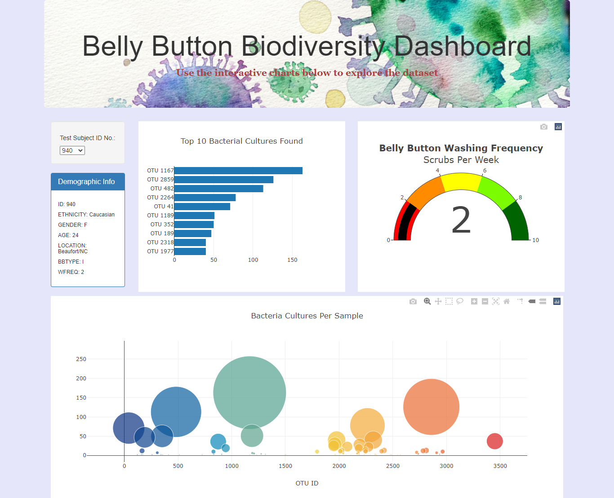

# Belly Button Biodiversity

## Overview

Rosa is biological researcher in a prominent microbiology lab. Her job is to discover and document the bacterias. She is currently researching bacterial species which synthasize the protein that tastes like beef. Her lab has partnered with Improbable Beef, a food startup, to search for candidate species. Rosa hypothesized that ideal species for synthetic beef are found in person's belly button.

### Purpose

Rosa has sampled bacteria from people's belly button across the country to identify and document the bacterial species colonizing the belly buttons. She is building a dashboard to rpesent the data to the participants of the study and her fellow researchers. The identity of each participant is anonymous and each one has been assigned a participant number. I am helping her build the dashboard.

## Dashboard Details

**Link to Belly Button Biodiversity Dashboard's GitHub Page:**
https://sanketkumaronline.github.io/Belly-Button-Biodiversity/

**Data Source:** samples.json

1. **Test Subject ID No.:** Since the identity of each participant of the study is anonymous, they have been assigned a *Test Subject ID Number*. We can select the id number from the drop-down menu in top left side of the dashboard to see the data for bacterial species colonizing that person's navel. 

2. **Demographic Info Panel:** Just below the drop-down where we select the Test Subject ID, there is small panel that shows some demograhic details of the subject id selected. However, no pesonal details are of the subject is mentioned.

3. **Horizonatal Bar Chart (Deliverable 1):** On the right side of Demogaphic Info panel, there is a horizontal bar chart showing "Top 10 Bacterial Cultures" found in the subject's belly button. Each bacteria species is identified by Operational Taxonomic Unit (OTU) number or *otu_ids* from the json file. The x-axis of the chart represents the *sample-values*. When we hover the mouse pointer over a bar, we can see the *otu-labels*. 

4. **Gauge Chart  (Deliverable 2):** The gauge chart on the far right shows the *Belly Button Washing Frequency* of the subject, measured in scrubs per week. The maximum value of this gauge chart is 10. There are five steps of interval 2, each represented by different colour.

5. **Bubble Chart  (Deliverable 3):** The bubble chart at the bottom shows all the Bacterial Cultures found in the belly button of the subject selected. Each bubble represents the *otu_ids*. The size of the bubble is determined by *sample_values*, and the colour by *otu_ids*. When we hover the mouse pointer over a bubble, we can see the *otu-labels*.  

## Dashboard Customization

1. Background image has been added to Jumbotron using following code:

    `
`

2. Background color added to `<body>` tag:

    `<body style="background-color: lavender;">`

3. Changed the font family and font colour of the second sentence in Jumbotron:
    
    `
<b>Use the interactive charts below to explore the dataset</b>
`